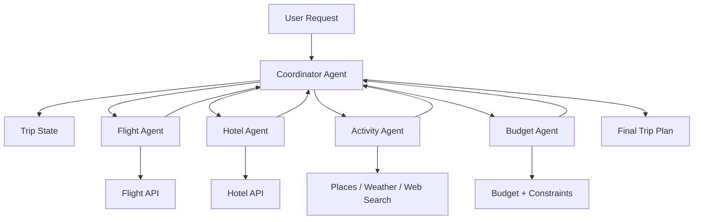

# Travel Planner Agent System Design

## 1. Overview

This project uses a multi-agent architecture to build a travel planning assistant. Instead of relying on a single large prompt-driven agent, the system is split into specialist agents with clearly defined responsibilities.

The main design choice is:

- A coordinator agent manages the overall flow
- Specialist agents handle domain-specific tasks
- Shared state stores the trip information
- External tools fetch live travel data and other useful information

This mirrors the wedding planner system design, but adapted to travel planning.

---

## 2. Core Design Idea

The system is designed around a coordination pattern:

1. The user gives a trip request
2. The coordinator extracts the key travel details
3. The state is populated with structured trip information
4. The coordinator calls specialized agents for different tasks
5. The results are combined into one final itinerary
6. The final response is returned to the user

This is better than a single monolithic agent because it keeps responsibilities separated, improves reliability, and makes debugging easier.

---

## 3. High-Level Architecture



---

## 4. System Components

### 4.1 Coordinator Agent
The coordinator is the main orchestrator.

Responsibilities:
- understand the user request
- extract destination, dates, travelers, budget, preferences
- update the trip state
- decide which specialists to call
- combine outputs into a final answer
- prevent unnecessary tool calls and loops

The coordinator is the “manager” of the whole system.

### 4.2 Trip State
The system keeps a structured memory object for the entire trip.

Example schema:

```python
class TripState:
    destination: str
    departure_city: str
    start_date: str
    end_date: str
    budget: float
    travelers: int
    trip_type: str
    preferences: str
    flights: list
    hotels: list
    activities: list
    total_estimated_cost: float
```

This ensures that specialists all work from the same source of truth.

### 4.3 Flight Agent
This agent focuses only on flights.

Responsibilities:
- search flight options
- compare routes, prices, and durations
- recommend best options based on budget and travel timing
- account for layovers and travel convenience

### 4.4 Hotel Agent
This agent handles lodging.

Responsibilities:
- identify hotels near the destination
- match hotel type to budget
- consider location, rating, and trip style
- recommend a shortlist

### 4.5 Activity Agent
This agent recommends local experiences.

Responsibilities:
- suggest sightseeing, food, culture, attractions
- align recommendations with traveler preferences
- generate a balanced itinerary

### 4.6 Budget Agent
This agent validates spending.

Responsibilities:
- calculate total trip cost
- compare total against the user budget
- flag risks
- suggest lower-cost alternatives if needed

---

## 5. Tool Layer

The agents rely on external tools to gather real information. These tools are the “hands” of the system.

Examples of tools:
- flight search API
- hotel search API
- weather service
- map or place search API
- web search tool
- currency conversion
- local event search

This adds real-world data to the reasoning process rather than relying purely on model memory.

---

## 6. Workflow

The system follows a predictable planning flow.

### Step 1: Receive user request
Example:

> Plan a 5-day trip to Lisbon for 2 people in September with a budget of $1200.

### Step 2: Extract structured data
The coordinator identifies:
- destination
- dates
- travelers
- budget
- trip preferences

### Step 3: Update trip state
The data is stored in the TripState object so all agents can access it.

### Step 4: Run specialist agents
The coordinator invokes the relevant agents:
- flight agent
- hotel agent
- activity agent
- budget agent

### Step 5: Combine results
The coordinator merges the outputs into one coherent trip recommendation.

### Step 6: Return final trip plan
The final response could include:
- flight suggestions
- hotel options
- daily activities
- total estimated cost
- recommendation summary

---

## 7. Decision Logic

The coordinator should not blindly call every agent for every request. It should decide dynamically.

Examples:
- If no destination is given, ask for it
- If dates are missing, ask for them
- If budget is very low, adjust hotel and activity recommendations
- If the user prefers relaxation, prioritize beaches, spas, and slow-paced activities
- If the user prefers adventure, prioritize tours and outdoor experiences

This avoids wasted tool calls and keeps the workflow efficient.

---

## 8. Guardrails and Reliability

Because this system interacts with real APIs and may do multiple searches, some safeguards are essential.

Recommended guardrails:
- validate input before calling tools
- reduce search loops using a search count limit
- handle API failures with retries
- avoid invalid date combinations
- check if the hotel and flight match the same destination/date window
- keep responses structured and concise
- stop and summarize if the tool output is poor or incomplete

This is especially important for production-quality agent systems.

---

## 9. Why This Architecture Was Chosen

This design was chosen because it offers several advantages:

### Separation of concerns
Each agent handles a specific domain.

### Better accuracy
Specialized agents can focus on one decision area at a time.

### Easier debugging
If flights are wrong, you can inspect only the flight agent and its tool usage.

### More scalable
New agents can be added later, such as:
- local transport agent
- dining agent
- visa/travel docs agent
- packing assistant

### Better user experience
The system feels more organized and expert-like than a single generic LLM answer.

---

## 10. Example User Journey

User prompt:

> I want a 4-day trip to Kyoto in October for 2 people. My budget is $1500 and I like temples, food, and quiet neighborhoods.

The coordinator:
- extracts destination: Kyoto
- dates: unspecified, asks follow-up or uses default range
- travelers: 2
- budget: $1500
- preferences: temples, food, quiet neighborhoods

Then:
- flight agent finds flight options
- hotel agent finds lodging in a central but quiet district
- activity agent suggests temples, food tours, local neighborhoods
- budget agent totals the recommendations and checks affordability

Finally:
- the coordinator returns a complete trip plan with budget and recommendation summary

---

## 11. Future Enhancements

This system can be expanded into a more advanced travel assistant with:

- user profile memory
- saved favorite destinations
- trip history
- itinerary editing
- booking confirmation flow
- weather-aware planning
- map-based route planning
- voice-based interaction
- multilingual support

---

## 12. Conclusion

The chosen system design is a coordinator-based multi-agent architecture. It is flexible, modular, and well-suited for travel planning because different parts of the trip require different expertise.

This architecture is the most practical design for building a travel planner because it combines:

- structured state management
- specialist agents
- real external tools
- clear orchestration logic
- scalable future extension

In short, the design is intentionally built like a travel team: one manager plus specialized experts, all working together to deliver a final plan.
